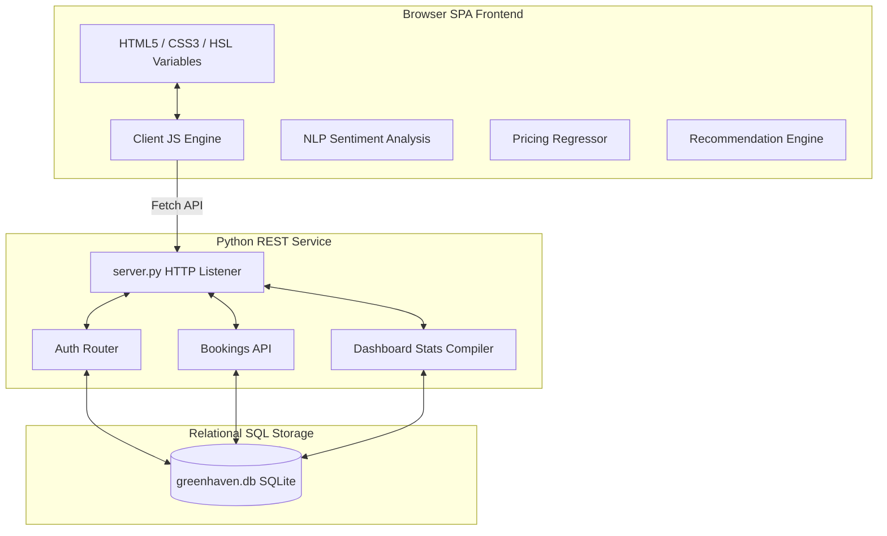

# 🌲 GreenHaven Eco-Retreat: AI-Powered Full-Stack Web Application

An interactive, responsive, single-page full-stack web application designed for a premium nature tourism center. Built on vanilla web standards (HTML5/CSS3/JavaScript) and a lightweight Python/SQLite backend, this project showcases the integration of **AI/ML simulation logic** within a clean full-stack architecture—specifically designed for a B.Tech career track in Artificial Intelligence and Machine Learning.

---

## Key Features

### 🧠 Integrated AI/ML Highlights
*   **💬 NLP Sentiment Analysis Classifier**: Parses user testimonials in real time using a client-side lexicon-scoring engine inside the reviews submission form. Computes numerical sentiment polarity scores and maps text to `Positive`, `Negative`, or `Neutral` labels, which are sent via REST API and persisted in the SQLite database.
*   **📈 Predictive Dynamic Pricing Regressor**: Calculates checkout surcharges or discounts dynamically based on calendar input features. Monsoons in India trigger an off-peak **-15% discount**, while winter holidays trigger a **+12% premium**. Weekend check-ins add a **+5% surcharge**. Confidence ratings dynamically fluctuate based on date variables.
*   **🎯 Association Affinity Recommendations**: Tracks chosen packages (*Nature Starter*, *Adventure Pro*, *Luxury Agro Retreat*) and cross-references user selections to display recommended experience add-ons (e.g. matching wilderness guides or dining upgrades) that can be added to the invoice with a single click.
*   **🎙️ Speech-Enabled Chatbot (Aranya)**: An interactive floating concierge widget using the browser's native Web Speech API (`speechSynthesis`) to read response text aloud, triggering dynamic bouncing soundwave animations, scrolled tours, and answering inquiries.

### ⚙️ Core Full-Stack Implementations
*   **🔑 User Authentication System**: Persistent session-based user authentication using `sessionStorage`. Prefills Name and Email inputs in the booking form dynamically when logged in. Supports administrative role control gate (`admin` vs `user`).
*   **💳 Secure Payment Gateway Simulation**: Features credit card inputs with validation checks. Employs the mathematical Luhn algorithm inside the client to validate card numbers. Detects prefixes to toggle card brand emblems (Visa, Mastercard, RuPay) and features a 3D-Secure processing spinner delay.
*   **🌤️ Live Weather Integration**: Fetches real-time weather logs for Coorg Forest coordinates client-side via the Open-Meteo REST API. Displays flashing emergency Monsoon Warning indicators if storms or heavy rain are reported.
*   **🗺️ Google Maps Location Block**: Embedded interactive Google Maps iframe inside the Contact section pointing to Coorg Reserve, Karnataka, India.
*   **📊 Administrative Dashboard (`admin.html`)**: Unlocks a comprehensive statistics control panel for administrators. Displays financial KPIs, custom SVG/Canvas bar and donut charts representing bookings and sentiment metrics, interactive database log tables, and a spreadsheet CSV bookings exporter.

---

## Application Screenshots

### 1. Modern GreenHaven Eco-Retreat Homepage


### 2. Interactive AI Concierge Chatbot & Soundwaves Visualizer


### 3. Dynamic pricing regression engine (Monsoon Discount applied)


### 4. Real-time review Natural Language Processing sentiment scoring


### 5. Premium Dark Theme Mode Layout (Emerald Theme)


### 6. Interactive Ticket Receipt Modal (with scannable entry barcode)


### 7. Filterable packages dashboard (Adventure package selection active)


### 8. Live Weather Widget (Open-Meteo Integration)


### 9. User Authentication & Booking Form Auto-Prefill


### 10. Simulated Credit Card Payment Gateway (Luhn validation active)


### 11. Interactive Secure Pass Ticket Pass (Gate Access Ticket)


### 12. Full-Stack Administration Dashboard (`admin.html`)


---

## System Architecture

The application is architected around a decoupling model between the Single-Page Application (SPA) user interface and the lightweight backend server:



1.  **Frontend (Client)**: SPA layout rendering content dynamically. Saves session state in `sessionStorage` and caches offline transactions in `localStorage` if the server is offline.
2.  **Backend (Python Server)**: Custom HTTP listener handling static file routing and REST API routing for auth, bookings, reviews, and statistics.
3.  **Database (SQLite)**: File-based relational database containing tables for `users`, `bookings`, `reviews`, and `contact_messages`.

---

## Technology Stack

*   **Frontend (User Interface)**:
    *   **Structure**: Vanilla HTML5 (semantic elements).
    *   **Styling**: Vanilla CSS3 using custom properties (HSL variables) for seamless Light/Dark theme switching, responsive Flexbox/Grid systems, and IntersectionObserver scroll reveals.
    *   **Logic**: Vanilla JavaScript managing real-time NLP classification, dynamic rate calculation, Web Speech synthesis voice guides, Luhn card checks, and SVG canvas charting.
*   **Backend (Web Service)**:
    *   **Environment**: Python 3.x.
    *   **Server**: Built entirely on built-in standard library `http.server` (zero external framework dependencies).
*   **Database (Datastore)**:
    *   **Engine**: SQLite3 file-based database (`greenhaven.db`).

---

## Project Structure

```text
nature-tourism-center-full-stack/
├── css/
│   └── main.css
├── img/
│   ├── avatar.jpg
│   ├── bg1.jpg
│   ├── logo.png
│   └── ...
├── js/
│   └── app.js
├── screenshots/
│   ├── homepage.png
│   ├── ai_chatbot.png
│   ├── package_filter.png
│   ├── dynamic_pricing.png
│   ├── booking_receipt.png
│   ├── dark_theme.png
│   ├── nlp_sentiment.png
│   ├── weather_widget.png
│   ├── form_prefilled.png
│   ├── payment_modal.png
│   ├── success_receipt.png
│   ├── admin_dashboard.png
│   └── admin_updated_records.png
├── greenhaven.db
├── index.html
├── admin.html
├── server.py
├── requirements.txt
├── .gitignore
└── README.md
```

---

## Prerequisites

*   **Python 3.x** installed.
*   **Pillow** (optional, only used if running screenshot overlay compiler scripts: `pip install Pillow`).

---

## Backend Setup

1.  **Clone the Repository**:
    ```bash
    git clone https://github.com/kompalwargangotri/nature-tourism-retreat.git
    cd nature-tourism-retreat
    ```

2.  **Start the Local Backend Server**:
    ```bash
    python server.py
    ```
    *The console will initialize, run database migrations, seed default reviews/users, and start listening on port 8080.*

3.  **Launch the Application**:
    *   Open your web browser and navigate to: `http://127.0.0.1:8080/`
    *   *Demo Accounts*:
        *   **Admin Account**: Username `admin` / Password `admin123` (unlocks administrative analytics panel at `admin.html`)
        *   **Guest Account**: Username `guest` / Password `guest123` (pre-fills booking form automatically)

---

## Testing and Validation

Verification and flow validation can be tested using the following test cases:

1.  **AI Rate Optimization Test**: 
    *   Select package *Adventure Pro* and set Check-in date to a monsoon date (e.g. `2026-07-20`). The pricing engine applies a **-15% monsoon discount** dynamically.
    *   Change the Check-in date to a weekend winter date (e.g. `2026-12-25`). The regressor dynamically compiles a **+12% seasonal surge** and **+5% weekend premium**.
2.  **NLP Test**:
    *   Write *"Beautiful and cozy eco-retreat, highly recommended!"* inside the reviews textarea. The NLP scoring badge updates to **Positive (100% confidence)**.
    *   Change comment text to *"Very poor guide service, clean up issues."*. The sentiment updates to **Negative**.
3.  **Luhn Card Payment Test**:
    *   Submit a booking and fill out the payment form with card number `4111 2222 3333 4444`. Click Authorize. The form triggers card validation, connects via spinners, and issues a successful gate pass ticket.
    *   Try submitting card number `4111 2222 3333 4445`. The Luhn module intercepts the click, flags a validation error, and blocks submission.
4.  **Admin analytics Test**:
    *   Navigate to `admin.html` as the admin. Verify metric totals, canvas graphs rendering, and click **Export Bookings CSV** to download a spreadsheet report.

---

## Author

**Gangotri Kompalwar**

- GitHub: <https://github.com/kompalwargangotri>
- LinkedIn: <https://www.linkedin.com/in/gangotri-kompalwar-4635b9359>
