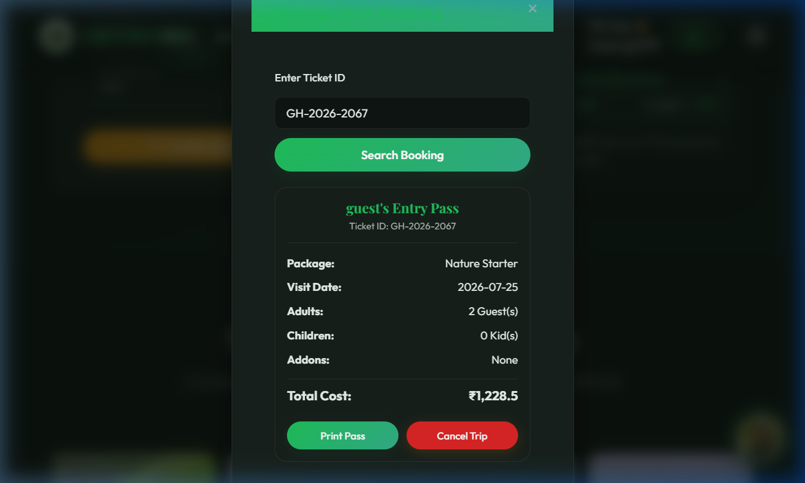
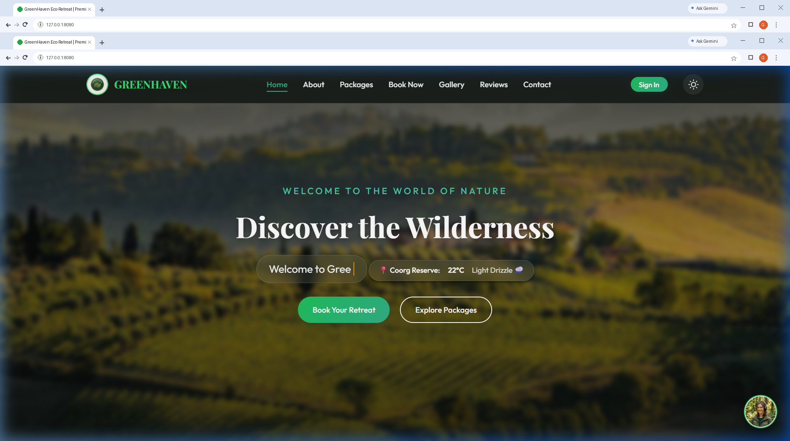
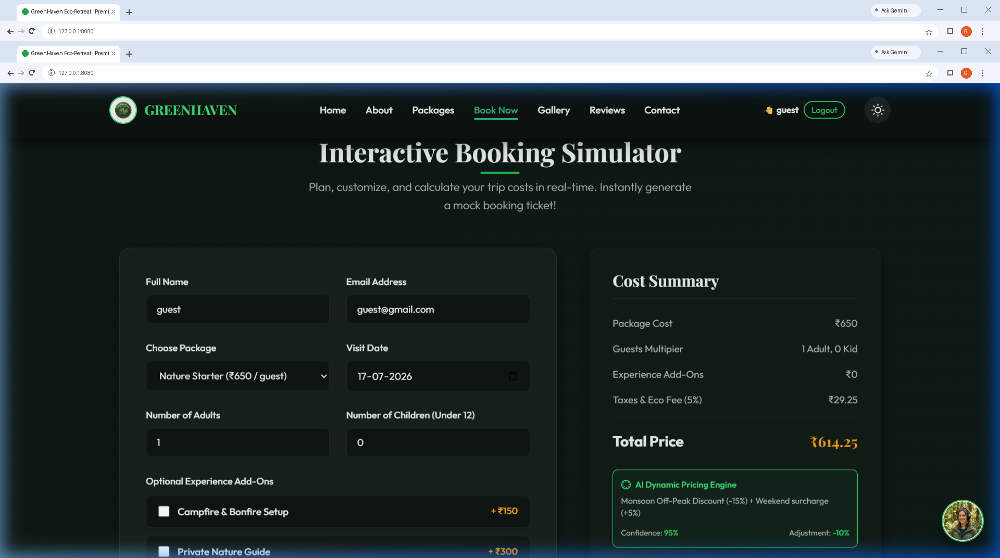
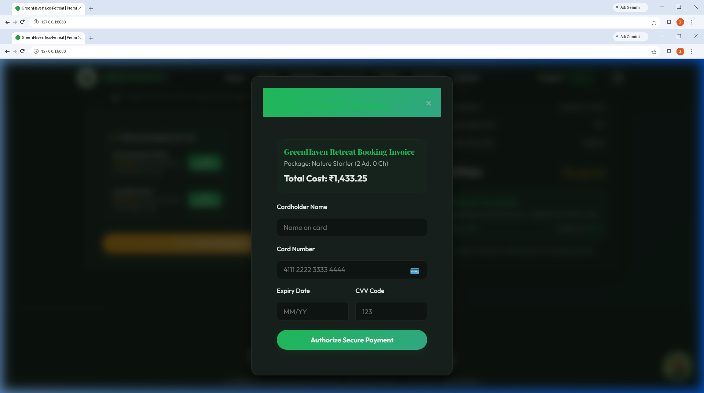
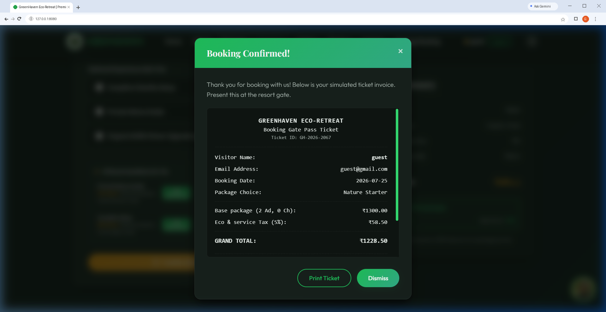
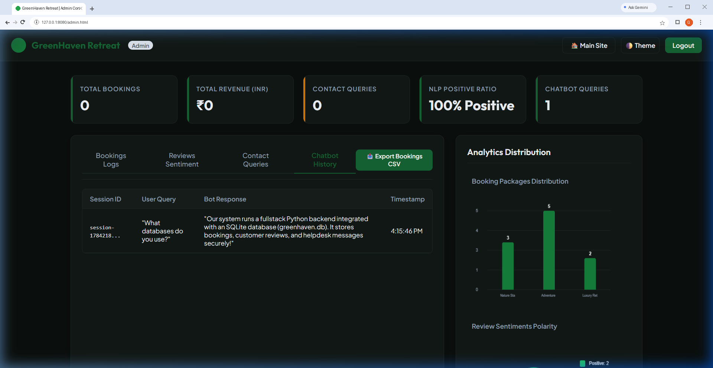
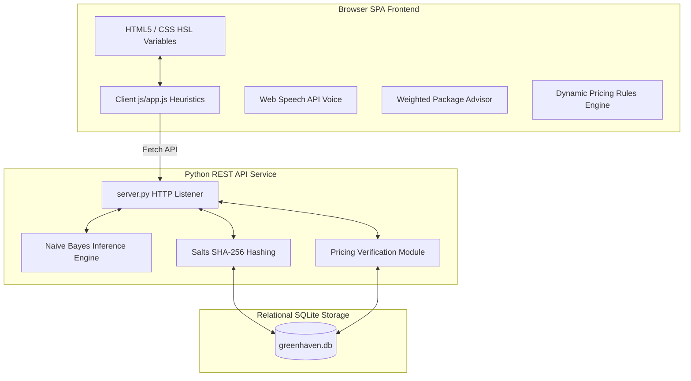

# 🌲 GreenHaven AI Eco-Retreat: AI-Integrated Full-Stack Application

**GreenHaven AI Eco-Retreat** is an AI-integrated full-stack tourism platform featuring a trained Naive Bayes sentiment classifier, an explainable weighted package advisor, transparent dynamic-pricing rules, weather integration, booking management and administrative analytics.

[](https://greenhaven-ai-eco-retreat.onrender.com)
[](https://github.com/kompalwargangotri/greenhaven-ai-eco-retreat)
[](https://www.python.org/)

> 🚀 **[Click here to view the live site →](https://greenhaven-ai-eco-retreat.onrender.com)**

---

## 📸 Screenshots

### 1. Modern GreenHaven Eco-Retreat Homepage


### 2. Interactive AI Concierge Chatbot & Soundwaves Visualizer


### 3. Dynamic pricing regression engine (Monsoon Discount applied)


### 4. Real-time review Natural Language Processing sentiment scoring


### 5. Premium Dark Theme Mode Layout (Emerald Theme)


### 6. Interactive Ticket Receipt Modal (with scannable entry barcode)



### 7. Filterable packages dashboard (Adventure package selection active)


### 8. Live Weather Widget (Open-Meteo Integration)



### 9. User Authentication & Booking Form Auto-Prefill



### 10. Simulated Credit Card Payment Gateway (Luhn validation active)



### 11. Interactive Secure Pass Ticket Pass (Gate Access Ticket)



### 12. Full-Stack Administration Dashboard (`admin.html`)



---

## Key Features

### 🧠 Integrated AI & Intelligent Heuristic Highlights

* **💬 Served NLP Sentiment Analysis Classifier**: Real-time review sentiment prediction served through backend Python endpoints. It tokenizes user inputs and executes multinomial Naive Bayes calculations to assign class labels (`positive`, `negative`, or `unknown` fallback) with normalized confidence probabilities.
* **🤖 Standalone Model Training (`train_model.py`)**: A Python trainer that loads data, divides reviews into a stratified training set (80 reviews) and test set (20 reviews), and exports serialized weights to `models/sentiment_model.json` and a validation report to `models/model_card.json`.
* **🎯 Explainable Weighted Package Advisor**: A deterministic collapsible widget helping visitors select tour packages based on custom preferences (activities, budget, group size, trip duration). Points are allocated using an explicit weighted matrix (Interest: 40 pts, Budget: 30 pts, Group: 15 pts, Duration: 15 pts) with deterministic tie-breaking logic.
* **📈 Dynamic Pricing Rules Engine**: Calculates surcharges or discounts dynamically based on seasonal and calendar dates (e.g. Monsoon off-peak discounts, Winter peak charges, and weekend surcharges). Employs additive combination logic capped at a strict ±20% limit.
* **🎙️ Virtual Resort Concierge (Aranya)**: A rule-based keyword-matching concierge drawer using the native browser Web Speech API (`speechSynthesis`) for audio narration and voice controls. Tracks dialogues and POSTs telemetry log tables to the SQLite database.

### ⚙️ Core Full-Stack Implementations

* **🔑 User Authentication System**: Session-based credentials checking. Prefills contact fields dynamically when logged in. *Security Notice*: Demonstration authentication using salted SHA-256 hashing. This implementation is for educational purposes and is not suitable for production. Production systems should use Argon2, bcrypt, scrypt, or PBKDF2 with secure session management.
* **🔍 Booking Lookup & Cancellation**: Customer gateway permitting visitors to enter booking ticket IDs, retrieve entries, reprint scannable passes, or issue trip cancellations via backend `DELETE` requests.
* **💳 Luhn Payment Validation**: Features card input fields utilizing the mathematical Luhn algorithm client-side to validate card integrity before processing transactions.
* **📊 Administration Moderation Dashboard (`admin.html`)**: Interactive control panel displaying revenue statistics, package breakdowns, reviews moderation, and chatbot logs telemetry with spreadsheet export options.

---

## System Architecture

The project maintains a clean separation of concerns between client browser capabilities and backend relational storage:

| Component | Classification | Implementation / Technology |
| :--- | :--- | :--- |
| **Review Sentiment Classifier** | Labeled Naive Bayes ML Model | Serviced via Python backend REST APIs |
| **Package Advisor** | Weighted preference-matching engine | Client-side JavaScript heuristics |
| **Dynamic Pricing** | Rule-based pricing engine | Client-side JavaScript + Python backend verification |
| **Weather Information** | External API Integration | Open-Meteo REST API |
| **Voice Narration** | Browser capability | Web Speech API |
| **Concierge Chatbot (Aranya)** | Rule-based keyword-matching concierge | Vanilla JavaScript |



---

## Project Structure

```text
greenhaven-ai-eco-retreat/
├── css/
│   └── main.css               # Core design system and theme-aware stylesheet
├── js/
│   └── app.js                 # Front-end heuristics, client advisor, and API integrations
├── img/                       # Resized and compressed image assets
│   ├── avatar.png / .jpg      # Concierge guide bot profile image
│   ├── logo.png / .jpg        # Resort brand logo image
│   └── ...                    # Package and gallery background snapshots
├── models/                    
│   ├── sentiment_model.json   # Serialized Naive Bayes ML model weights
│   └── model_card.json        # Evaluation performance card and reproducibility metadata
├── screenshots/               # Framed application feature walkthrough snapshots
├── tests/
│   └── test_suite.py          # Backend automated unit tests suite
├── greenhaven.db              # SQLite relational datastore
├── index.html                 # Main customer reservation landing portal
├── admin.html                 # Moderation and administrative analytics dashboard
├── server.py                  # Full-stack Python HTTP REST API server
├── train_model.py             # ML classifier offline training script
├── favicon.svg                # Emerald-and-gold "GK" brand favicon
├── requirements.txt           # Cloud deployment dependency specification
└── README.md                  # System documentation
```

---

## Setup & Running

1. **Start the Server**:

    ```bash
    python server.py
    ```

    *The database is initialized and seeds default mock data if empty.*

2. **Open the Application**:
    * Navigate to `http://localhost:8080/` in your browser.
    * **Admin Login**: `admin` / `admin123`
    * **Guest Login**: `guest` / `guest123`

---

## Testing & Verification

### 1. Automated Backend Unit Tests

Run the automated test suite verifying database functions, password hashing checks, endpoint status, and sentiment inference boundaries:

```bash
python -m unittest discover -s tests -p "test_*.py" -v
```

*Note: Python tests validate backend functionality and equivalent business-rule specifications. Browser-side advisor and pricing behavior is verified separately through manual UI tests and is not executed by the Python test suite.*

### 2. ML Classifier Evaluation

Re-train and evaluate the sentiment model:

```bash
python train_model.py
```

*Disclaimer: Evaluation metrics demonstrate the implementation pipeline and should not be interpreted as production-level model performance because of the limited dataset.*

### 3. Manual UI Boundary Verification Cases

* **Pricing Engine**: Check date selectors on weekends vs weekdays during Monsoon (July) and Winter (December) months. Verify that adjustments combined do not exceed the strict ±20% clamping limits, and final payable totals round correctly to two decimal places.
* **Weighted Package Advisor**: Open the collapsable card above the package dropdown. Choose incomplete fields to verify validation error logs. Select matching preferences to verify that the highest scoring package is selected with tie-breakers applying correctly (Nature Starter -> Adventure Pro -> Luxury Agro Retreat).
* **Offline Fallback**: Shut down the python server and submit a new review. Verify that the live sentiment indicator falls back gracefully to standard "Neutral" or displays offline warnings without blocking form submission.

---

## Author

**Gangotri Kompalwar**

- [GitHub](https://github.com/kompalwargangotri)
  
- [LinkedIn](https://www.linkedin.com/in/gangotri-kompalwar-4635b9359)

- [Portfolio](https://kompalwargangotri.github.io/)
  
- [Email](mailto:kompalwargangotri@gmail.com)
